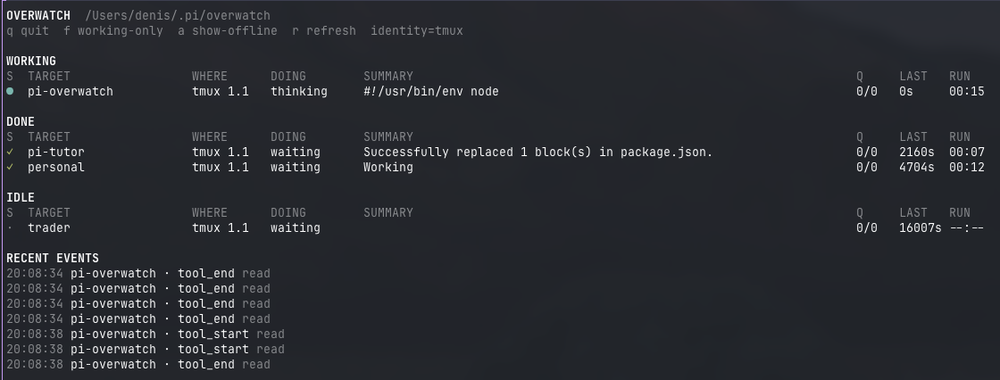

# pi-overwatch

```bash
pi install npm:pi-overwatch
```

Minimal observability for your Pi sessions.

I built `pi-overwatch` because I wanted a simple way to see what my Pi sessions were doing while multitasking.

I use tmux with a "one session per project" setup, so Overwatch uses the tmux session name as the main target label when Pi is running inside tmux. If you're not using tmux, it falls back to the directory where you launched Pi.

There are already agent control-center tools and tmux dashboards out there, but I wanted something smaller and calmer: a lightweight TUI that gives me live status for Pi instances without changing how I work.

You can run it anywhere in your terminal setup — inside a tmux pane, in a separate terminal window, or in something like Ghostty.

## Demo

[](https://www.youtube.com/watch?v=Y33AkG2fl8Q)

Watch the demo video on YouTube:

- https://www.youtube.com/watch?v=Y33AkG2fl8Q

## Screenshot



## What it shows

- current Pi session status at a glance
- tmux-session-aware target labels
- cwd fallback when tmux is not available
- current phase or tool activity
- queue counts, heartbeat age, and runtime
- stale-session detection
- simple local config in `~/.pi/overwatch/config.json`

## Demo
https://github.com/user-attachments/assets/fda9077b-3a37-4d1a-8adc-827d17dc7f53

## Install

### From npm

```bash
pi install npm:pi-overwatch
```

### From GitHub

```bash
pi install https://github.com/denismrvoljak/pi-overwatch
```

### Project-local install

```bash
pi install -l npm:pi-overwatch
```

### One-off test

```bash
pi -e npm:pi-overwatch
```

## Run Overwatch

Open another terminal pane or window and run:

```bash
pi-overwatch
```

If you want to run it directly from the repo:

```bash
node /absolute/path/to/pi-overwatch/bin/pi-overwatch.js
```

## How targeting works

Overwatch is tmux-aware, not tmux-dependent.

Target resolution is:

1. tmux session name
2. Pi session name
3. cwd basename

That means if you use a tmux workflow like "one tmux session per project", the dashboard naturally follows that naming. If you are not using tmux, it still works fine and identifies sessions from the directory where Pi was launched.

## Dashboard columns

- `S` — status icon
- `TARGET` — main identity for the Pi instance
- `WHERE` — source context, usually tmux pane info like `tmux 1.1`
- `DOING` — current phase or tool
- `SUMMARY` — short activity summary
- `Q` — steering/follow-up queue counts
- `LAST` — seconds since last heartbeat
- `RUN` — elapsed runtime for the current or most recent task

Status icons:

- `●` working
- `✓` done
- `!` stale
- `✕` error
- `○` offline

## Configuration

Overwatch reads config from:

```bash
~/.pi/overwatch/config.json
```

You can start from the example file:

```bash
mkdir -p ~/.pi/overwatch
cp /absolute/path/to/pi-overwatch/config.example.json ~/.pi/overwatch/config.json
```

Example:

```json
{
  "dashboard": {
    "identity": "auto",
    "showColumnHeader": true
  }
}
```

### `dashboard.identity`

Supported values:

- `"auto"` — tmux session name, then Pi session name, then cwd basename
- `"tmux"` — prefer tmux session name
- `"cwd"` — show cwd basename only
- `"both"` — show tmux session name plus cwd basename when they differ, for example `api · my-monorepo`

### `dashboard.showColumnHeader`

- `true` — show headers
- `false` — hide headers

### `tmux`

- `notify` — show a tmux `display-message` when an agent finishes or errors while its pane is not visible (default `true`)
- `bell` — also ring the terminal bell on finish, so `monitor-bell` / your terminal can flag it (default `false`)

## tmux integration

### Status line

`pi-overwatch statusline` prints a one-line, tmux-styled summary of all live Pi sessions, meant for embedding in the tmux status bar:

```tmux
set -g status 2
set -g status-format[1] "#[align=left] #(pi-overwatch statusline)"
```

Flags:

- `--plain` — no tmux style markup (for use outside tmux)
- `--session NAME` — only show agents in that tmux session
- `--max N` — max entries before collapsing to `+N` (default 6)
- `--theme dark|light|auto` — color palette (default `auto`)

#### Colors and light/dark themes

With `auto` (the default), the theme is resolved from tmux options:

1. `@pi_overwatch_theme` — set `tmux set -g @pi_overwatch_theme light` (or `dark`) to pin it
2. `@powerkit_theme_variant` — `latte` maps to light, anything else to dark
3. falls back to dark

Pin a theme or override individual colors in the config:

```json
{
  "statusline": {
    "theme": "light",
    "colors": {
      "done": "#40a02b"
    }
  }
}
```

Color keys: `working`, `stale`, `done`, `error`, `idle`, `dim`, `sep`.

Finished and idle entries drop off after 10 minutes (`PI_OVERWATCH_STATUS_TTL_MS` to change).

When two agents resolve to the same label (for example two Pi sessions in one tmux session), the statusline disambiguates them with the tmux window name and pane index: `personal:api.2 · personal:blog.1`. Unique labels stay unsuffixed.

### Dashboard keybindings

```tmux
# floating pane (tmux >= 3.7, non-modal — keeps working underneath)
bind o new-pane "pi-overwatch"

# popup fallback (tmux >= 3.2, modal)
bind O display-popup -E -w 85% -h 70% "pi-overwatch"
```

### Notifications

When running inside tmux, the extension shows a `display-message` on every attached client when an agent finishes or errors — but only if the agent's pane is not currently visible. Disable with `"tmux": { "notify": false }` in the config.

## Controls

- `q` quit
- `f` toggle working-only view
- `a` toggle offline rows
- `r` force refresh

## State directory

By default, Overwatch stores data in:

```bash
~/.pi/overwatch
```

Structure:

```text
~/.pi/overwatch/
├── agents/
│   └── <agent-id>.json
├── config.json
└── events.jsonl
```

Override the root directory with:

```bash
export PI_OVERWATCH_DIR=/some/other/path
```

Other environment overrides:

```bash
export PI_OVERWATCH_REFRESH_MS=1000
export PI_OVERWATCH_STALE_MS=30000
```

## Pi command

The extension also registers:

```text
/overwatch
```

That command shows the current state file path for the active Pi instance.

## Package structure

```text
pi-overwatch/
├── bin/
│   └── pi-overwatch.js
├── extensions/
│   └── overwatch.ts
├── config.example.json
├── LICENSE
├── package.json
└── README.md
```

## Notes

- best results come from launching Pi inside the tmux pane you want associated with the row
- Overwatch does not rename tmux sessions or take over your workspace
- it is intentionally minimal and focused on observability
- Pi loads the extension directly from TypeScript
- there is no build step
