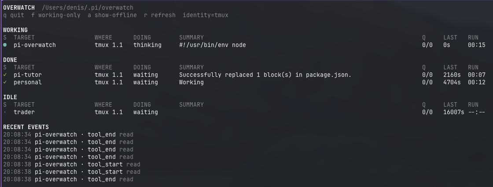

# pi-overwatch

```bash
pi install npm:pi-overwatch
```

Minimal observability for your coding harnesses.

I built `pi-overwatch` because I wanted a simple way to see what my coding sessions were doing while multitasking.

I use tmux with a "one session per project" setup, so Overwatch uses the tmux session name as the main target label when the agent is running inside tmux. If you're not using tmux, it falls back to the directory where you launched it.

Supported harnesses:

- **Pi** — installed as an extension
- **Claude Code** — installed as hooks, see [Claude Code](#claude-code)

The dashboard doesn't care which one wrote a state file, so they share one view, one status line, and one keybinding.

There are already agent control-center tools and tmux dashboards out there, but I wanted something smaller and calmer: a lightweight TUI that gives me live status for my harnesses without changing how I work.

You can run it anywhere in your terminal setup — inside a tmux pane, in a separate terminal window, or in something like Ghostty.

## Demo

[](https://www.youtube.com/watch?v=Y33AkG2fl8Q)

Watch the demo video on YouTube:

- https://www.youtube.com/watch?v=Y33AkG2fl8Q

## Screenshot



## What it shows

- current session status at a glance, whichever harness it is
- tmux-session-aware target labels
- cwd fallback when tmux is not available
- current phase or tool activity
- which sessions are blocked waiting on you
- queue counts, heartbeat age, and runtime
- stale-session detection
- simple local config in `~/.pi/overwatch/config.json`

## Demo
https://github.com/user-attachments/assets/fda9077b-3a37-4d1a-8adc-827d17dc7f53

## Install

### From npm

```bash
pi install npm:pi-overwatch
```

### From GitHub

```bash
pi install https://github.com/denismrvoljak/pi-overwatch
```

### Project-local install

```bash
pi install -l npm:pi-overwatch
```

### One-off test

```bash
pi -e npm:pi-overwatch
```

## Run Overwatch

Open another terminal pane or window and run:

```bash
pi-overwatch
```

If you want to run it directly from the repo:

```bash
node /absolute/path/to/pi-overwatch/bin/pi-overwatch.js
```

## How targeting works

Overwatch is tmux-aware, not tmux-dependent.

Target resolution is:

1. tmux session name
2. agent session name
3. cwd basename

That means if you use a tmux workflow like "one tmux session per project", the dashboard naturally follows that naming. If you are not using tmux, it still works fine and identifies sessions from the directory where the agent was launched.

## Dashboard columns

- `S` — status icon
- `SRC` — which agent produced the row (`π` Pi, `✳` Claude Code)
- `TARGET` — main identity for the agent
- `WHERE` — source context, usually tmux pane info like `tmux 1.1`
- `DOING` — current phase or tool
- `SUMMARY` — short activity summary
- `Q` — steering/follow-up queue counts
- `LAST` — seconds since last heartbeat
- `RUN` — elapsed runtime for the current or most recent task

Status icons:

- `●` working
- `⏸` blocked — waiting on you (permission prompt)
- `✓` done
- `!` stale — claimed to be working, then went silent
- `✕` error
- `○` offline

## Claude Code

Overwatch also tracks Claude Code sessions in the same dashboard and statusline. The dashboard does not care what produced a state file, so both agents share one view, one tmux binding, and one status line.

Install the hooks:

```bash
pi-overwatch install-claude-hooks
```

Flags:

- `--project` — write to `./.claude/settings.json` instead of `~/.claude/settings.json`
- `--dry-run` — print the resulting settings without writing
- `--uninstall` — remove Overwatch hooks again

The command is idempotent, backs up the previous file to `settings.json.overwatch-backup`, and leaves any other hooks you already have configured untouched. Restart Claude Code afterwards.

Rows are tagged by source in the `SRC` column and in the statusline:

- `π` — Pi
- `✳` — Claude Code

Hide the tag in the statusline with `--no-source`, or filter to one agent with `--source pi` / `--source claude-code`.

### How it differs from the Pi extension

Pi runs Overwatch as a long-lived extension, so it can heartbeat every 5 seconds. Claude Code has no such process — each hook is its own short-lived invocation — so there is nothing to heartbeat from. Instead the Claude Code producer writes a `staleMs` field on its own state, and the dashboard honours that per agent rather than applying the global `PI_OVERWATCH_STALE_MS`. Default is 3 minutes; change it with `claudeCode.staleMs` in the config.

Claude Code also exposes a signal Pi does not: it fires `Notification` when it blocks on a permission prompt. Those rows get their own `blocked` group and a `⏸` icon, and trigger a tmux message when the pane is not visible, since an agent waiting on you is the thing most worth surfacing.

The same hook also fires on a plain idle timeout roughly a minute after Claude has already stopped, which means the two cases must be told apart by message text — treating an idle ping as activity resurrects a finished session into `working`, where it then goes stale and shows `!`. Only a message matching a permission prompt sets `blocked`; an idle one leaves a finished status alone; an unrecognised one changes no status at all.

Relatedly, `stale` now means "claimed to be working, then went silent". An agent blocked on a human is not stale no matter how long it sits there, so `blocked` rows and anything with phase `waiting` are exempt from the stale window.

### Hook mapping

| Overwatch state | Claude Code hook |
| --- | --- |
| session registered, `idle` | `SessionStart` |
| `working` / `thinking` | `UserPromptSubmit` |
| `working` / `tool` | `PreToolUse` |
| back to `thinking`, or `error` | `PostToolUse` |
| `blocked`, or idle-with-no-change | `Notification` |
| `done` + tmux notify | `Stop` |
| `offline` | `SessionEnd` |

## Configuration

Overwatch reads config from:

```bash
~/.pi/overwatch/config.json
```

You can start from the example file:

```bash
mkdir -p ~/.pi/overwatch
cp /absolute/path/to/pi-overwatch/config.example.json ~/.pi/overwatch/config.json
```

Example:

```json
{
  "dashboard": {
    "identity": "auto",
    "showColumnHeader": true
  }
}
```

### `dashboard.identity`

Supported values:

- `"auto"` — tmux session name, then agent session name, then cwd basename
- `"tmux"` — prefer tmux session name
- `"cwd"` — show cwd basename only
- `"both"` — show tmux session name plus cwd basename when they differ, for example `api · my-monorepo`

### `dashboard.showColumnHeader`

- `true` — show headers
- `false` — hide headers

### `claudeCode`

- `staleMs` — how long a Claude Code agent may go without a hook before it reads as stale (default `180000`)
- `notify` / `bell` — same meaning as `tmux` below; set here to override for Claude Code only

### `tmux`

- `notify` — show a tmux `display-message` when an agent finishes or errors while its pane is not visible (default `true`)
- `bell` — also ring the terminal bell on finish, so `monitor-bell` / your terminal can flag it (default `false`)

## tmux integration

### Ready-made config

[`examples/tmux.conf`](examples/tmux.conf) provides a compact agent row with palette-aware colors and optional dashboard bindings. Copy it to `~/.config/tmux/overwatch.conf`, then add this **after** your existing status-bar theme/plugin configuration in `~/.tmux.conf`:

```tmux
source-file ~/.config/tmux/overwatch.conf
```

Reload with `tmux source-file ~/.tmux.conf`. The example preserves your main row (`status-format[0]`), sets the status area to two rows, and uses the second row for Overwatch. If you already have multiple status rows, adjust its index and row count before sourcing it. Keybindings and refresh-interval changes are commented out so the example does not override them unexpectedly. `pi-overwatch` must be on the tmux server's PATH. The example is also included in the npm package under `examples/`.

### Status line

`pi-overwatch statusline` prints a one-line, tmux-styled summary of all live sessions, meant for embedding in the tmux status bar:

```tmux
set -g status 2
set -g status-format[1] "#[align=left] #(pi-overwatch statusline)"
```

Flags:

- `--plain` — no tmux style markup (for use outside tmux)
- `--session NAME` — only show agents in that tmux session
- `--max N` — max entries before collapsing to `+N` (default 6)
- `--theme dark|light|auto` — color palette (default `auto`)
- `--source pi|claude-code` — only show agents from that tool
- `--no-source` — hide the `π` / `✳` source glyph

The row uses a status-colored indicator, neutral session name, and muted activity/time so it stays scannable without coloring the whole label. Agents inherit the status row background and are separated by muted vertical rules with two spaces on either side. This separates agents without adding hard-edged background blocks or competing with the main tmux bar's Powerline arrows. `--plain` remains unstyled and uses ASCII separators. Add `--no-source` to hide the tool glyph for a quieter row; keep it when distinguishing Pi from Claude Code matters.

#### Colors and light/dark themes

The dashboard and statusline read `@powerkit_theme` on each refresh: `catppuccin` selects Latte/Mocha colors; `rose-pine` and unknown/unset families use Dawn/Moon. This keeps Overwatch aligned with its tmux host without a separate settings watcher. Catppuccin dark variants currently use Mocha colors.

With `auto` (the default), brightness is resolved in this order:

1. `@pi_overwatch_theme` — `light` or `dark` pins brightness
2. `@powerkit_theme_variant` — `latte` and `dawn` map to light; other nonempty variants map to dark
3. Legacy `~/.config/theme-mode`, then dark if absent

Explicit `--theme` or `statusline.theme` light/dark choices override brightness, not the tmux palette family. Custom `statusline.colors` still wins over palette colors. Reopen an already-running dashboard once after upgrading; subsequent tmux palette changes apply on its regular refresh. Run `node --test bin/theme.test.js` to test palette resolution through the real CLI with isolated tmux responses.

Pin a theme or override individual colors in the config:

```json
{
  "statusline": {
    "theme": "light",
    "colors": {
      "done": "#40a02b"
    }
  }
}
```

Color keys: `working`, `stale`, `done`, `error`, `idle`, `dim`, `sep`.

Finished and idle entries drop off after 10 minutes (`PI_OVERWATCH_STATUS_TTL_MS` to change).

When two agents resolve to the same label (for example two Pi sessions in one tmux session), the statusline disambiguates them with the tmux window name and pane index: `personal:api.2 · personal:blog.1`. Unique labels stay unsuffixed.

### Dashboard keybindings

```tmux
# floating pane (tmux >= 3.7, non-modal — keeps working underneath)
bind o new-pane "pi-overwatch"

# popup fallback (tmux >= 3.2, modal)
bind O display-popup -E -w 85% -h 70% "pi-overwatch"
```

### Notifications

When running inside tmux, the extension shows a `display-message` on every attached client when an agent finishes or errors — but only if the agent's pane is not currently visible. Disable with `"tmux": { "notify": false }` in the config.

## Controls

- `q` quit
- `f` toggle working-only view
- `a` toggle offline rows
- `r` force refresh

## State directory

By default, Overwatch stores data in:

```bash
~/.pi/overwatch
```

Structure:

```text
~/.pi/overwatch/
├── agents/
│   └── <agent-id>.json
├── config.json
└── events.jsonl
```

Override the root directory with:

```bash
export PI_OVERWATCH_DIR=/some/other/path
```

Other environment overrides:

```bash
export PI_OVERWATCH_REFRESH_MS=1000
export PI_OVERWATCH_STALE_MS=30000
```

## Pi command

The Pi extension also registers:

```text
/overwatch
```

That command shows the current state file path for the active Pi instance.

## Package structure

```text
pi-overwatch/
├── bin/
│   └── pi-overwatch.js
├── extensions/
│   └── overwatch.ts
├── hooks/
│   ├── claude-code.js
│   └── install.js
├── config.example.json
├── LICENSE
├── package.json
└── README.md
```

## Notes

- best results come from launching the agent inside the tmux pane you want associated with the row
- Overwatch does not rename tmux sessions or take over your workspace
- it is intentionally minimal and focused on observability
- Pi loads the extension directly from TypeScript
- Claude Code drives state from hooks, so there is no process to keep running
- there is no build step
